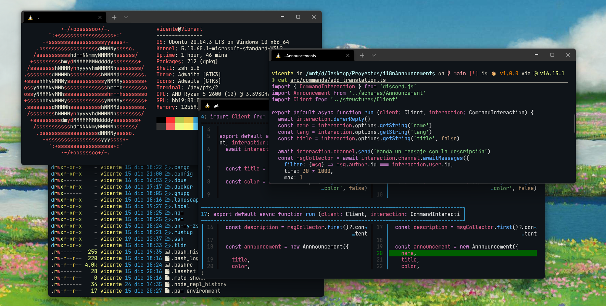

# 🪄 Dotfiles
My personal dotfiles for [Nobara](https://nobaraproject.org/).
These dotfiles are compatible with any distribution using dnf as package manager.

## Usage
1. Clone this repo in your home folder, `git clone https://github.com/Vicente015/dotfiles && cd dotfiles`.
2. Modify the `name` and `email` in `gitconfig`, remove `signingkey` and `gpgsign = true` if you don't use pgp keys to sign commits.
3. Execute the install script, `./install.sh`.
4. Enjoy :).
